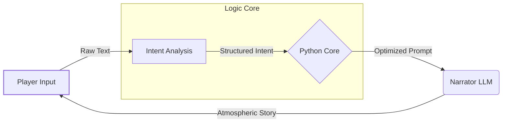

# NarrativeNode: The Systemic RPG Engine

The primary bottleneck in Generative AI gaming is **consistency**. Standard LLM-based games suffer from "hallucinations"—where the AI forgets established lore, breaks game rules, or generates illogical outcomes in favor of creative writing.

**NarrativeNode** is not just a game engine; it is a solution to the "Creativity vs. Consistency" dilemma. We are building a system where infinite creative freedom meets strict, rule-based logic.

## 💡 Our Solution: The "Judge-First" Architecture

NarrativeNode implements a proprietary multi-agent pipeline designed to enforce logic within an open-ended world. Unlike traditional systems that rely solely on a creative writer agent, we separate **Intent**, **Logic**, and **Narration**.

### 1. The "AI Judge" System (Intent Analysis)
Instead of letting a massive LLM hallucinate a response immediately, the player's input first passes through a lightweight **Judge Agent**.

* **Function:** The Judge analyzes the raw player input to extract **intent** and **actions** (e.g., "Attack the guard" vs. "Persuade the guard").
* **Logic (The Python Middleware):** The Judge's structured output is sent to the **Python Engine**. The engine calculates the outcome based on game stats, RNG, and world rules—completely deterministic and hallucination-free.
* **Result:** The Engine constructs a specific, optimized prompt for the Narrator. This ensures the story always follows the game's mathematical rules and significantly **reduces token costs** by filtering unnecessary context.

### 2. Iterative Fine-Tuning Pipeline
We do not rely on "out-of-the-box" models. Our development methodology involves a continuous cycle of Domain-Specific Fine-Tuning:

* Models are trained specifically on our custom datasets to understand not just "how to write," but "how to adhere to game mechanics."
* Every development phase contributes new data to refine the model's adherence to the project's unique tone (Dark Fantasy / Lovecraftian).

### 3. Constrained Player-Driven Generation
Players are empowered to shape the world using Generative AI, but strictly within the engine's boundaries.

* **Dynamic Assets:** Whether generating unique items, locations, or lore, the engine applies "Style & Logic Wrappers" to ensure player creations fit the game's tone and balance.
* **Rule Compliance:** A player can request anything, but the engine only generates what is possible within the simulation's logic.

---

## ⚙️ Workflow Architecture

The following diagram illustrates how we maintain consistency and reduce costs:

## 🔧 Tech Stack

* **Orchestration:** Python-based Multi-Agent System (Judge, Narrator, World Manager).
* **Logic Core:** Graph Theory for non-Euclidean location tracking (Mapless Navigation).
* **AI Integration:** Custom Fine-Tuned adapters for **Claude 3.5 Sonnet** (Creative) and optimized SLMs (Logic).
* **Client:** Godot Engine (4.x) for UI and Visual Feedback.

## 🗺 Roadmap

* **Phase 1: Proof of Concept:** Implementing the "Judge -> Engine -> Narrator" pipeline to filter hallucinations.
* **Phase 2: Fine-Tuning:** Training smaller models (SLMs) for cost-effective rule enforcement and intent analysis.
* **Phase 3: Cloud Infrastructure:** Deploying the multi-agent swarm on AWS/GCP for scalable inference.
* **Phase 4: Alpha Release:** Opening the "Systemic RPG" to early testers.

## 🤝 Contact & Collaboration

NarrativeNode is aiming to set a new standard for reliability in AI-generated media.

📧 **Contact:** narrativenode.labs@gmail.com
